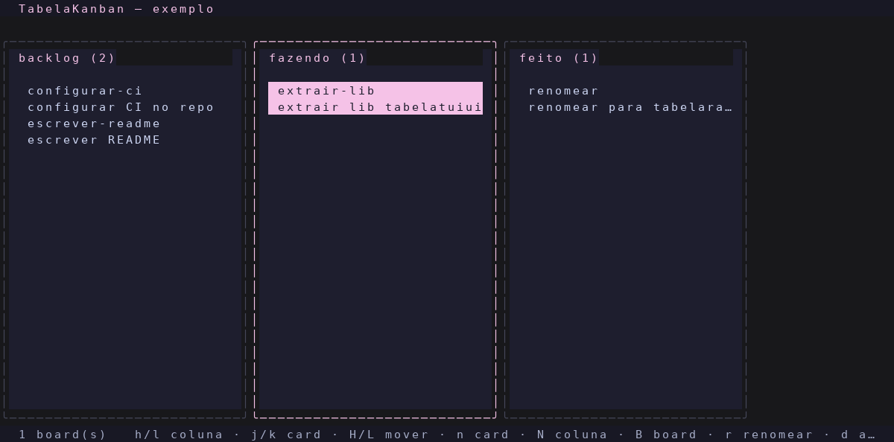

<div align="center">

# TabelaKanban

**Kanban TUI sobre arquivos de texto puro** — cada card é um `.md`, cada
coluna é uma pasta, cada board é uma pasta de pastas. Move um card e move um
arquivo; edita no seu `$EDITOR` e o git cuida do resto.

[](go.mod)
[](LICENSE)
[](https://github.com/charmbracelet/bubbletea)
[](https://github.com/TabelaDev/tabelatuiui)

[](https://ko-fi.com/ianptkcs)

</div>

---

## O que é

Um [Bubble Tea](https://github.com/charmbracelet/bubbletea) TUI kanban que
vive em cima de pastas e arquivos markdown, sem banco nenhum. A estrutura no
disco É o board:

```
~/kanban/
  exemplo/
    backlog/
      configurar-ci.md
      escrever-readme.md
    fazendo/
      extrair-lib.md
    feito/
      renomear.md
```

Board = pasta, coluna = subpasta, card = arquivo `.md`. Nada de metadado
separado: mover um card é `mv` de arquivo (preservável em git), o título é o
nome do arquivo e o corpo é o conteúdo. Abre com `enter` no seu `$EDITOR` e o
card é o markdown que você já escreve todo dia.



## Índice

- [Instalação](#instalação)
- [Uso](#uso)
- [IPC](#ipc)
- [Configuração](#configuração)
- [Licença](#licença)

## Instalação

Requer Go 1.26+.

```bash
go install github.com/ianptkcs/tabelakanban@latest
```

Ou compilando a partir do source:

```bash
git clone https://github.com/TabelaDev/tabelakanban.git
cd tabelakanban
go build -o tabelakanban .
```

Pra usar como comando global (precisa que `~/.local/bin` esteja no seu `PATH`):

```bash
go build -o ~/.local/bin/tabelakanban .
```

## Uso

```
tabelakanban         # abre a TUI
tabelakanban list    # dump em texto plano, sem TTY — útil pra scriptar
```

Dentro da TUI:

- `h`/`l` navegam entre colunas — na primeira coluna, `h` entra na sidebar de
  boards, onde `j`/`k` trocam de board e `enter`/`l` voltam às colunas.
- `j`/`k` navegam entre cards da coluna focada.
- `H`/`L` movem o card selecionado para a coluna ao lado.
- `ctrl+h`/`ctrl+l` reordenam a coluna focada (mover a coluna em si).
- `n` cria card, `N` cria coluna, `B` cria board (novo board na primeira
  raiz), `r` renomeia o card selecionado, `R` renomeia a coluna, `d` apaga o
  card e `D` apaga a coluna (todos com confirmação/prompt modal).
- `t` define/limpa o due date do card selecionado (formato `DD/MM`, vazio
  limpa). O due fica no front-matter do `.md` e aparece no rodapé do card (em
  vermelho quando vencido); criar card já deixa você preencher o due.
- `o` abre/fecha uma coluna lateral com o preview do markdown do card
  selecionado; `enter` abre o card no `$EDITOR` (padrão `nvim`).
- `g` abre a página de log de atividades (o que foi feito); `q`/`esc`/`h`/`l`
  fecha.
- `ctrl+e` colapsa/expande a sidebar de boards (visível por padrão),
  `ctrl+r` reescaneia, `q` sai.

Cards numa mesma coluna aparecem em ordem alfabética de título.

## IPC

Pra scripts ou pra um LLM perguntar "o que tem na fila, em que coluna cada
coisa está" sem abrir a TUI, `tabelakanban` expõe o mesmo subcomando
`ipc <método> --json` de `djobs`/`tabelaradar`:

```bash
tabelakanban ipc boards.list --json                 # todos os boards, colunas e cards
tabelakanban ipc boards.list name=exemplo --json    # só um board
tabelakanban ipc boards.next --json                 # o card que o próprio tabelakanban priorizaria
```

`boards.next` devolve o primeiro card da primeira coluna que não parece
"done" (por nome: `done`, `feito`, `conclu...`) — no mesmo espírito do
`projects.next` do tabelaradar.

## Configuração

### Quais roots monitorar

`~/.config/tabelakanban/config` (padrão do `os.UserConfigDir()`; sobrescrível
via `TABELAKANBAN_CONFIG`) lista, uma entrada por linha, as pastas cujos
filhos são boards:

```
~/kanban
~/codigo/pessoal/meu-time
```

Linhas em branco e começando com `#` são ignoradas. Sem esse arquivo, o
comportamento é o de sempre: varre só `TABELAKANBAN_ROOT` (ou `~/kanban`).

### Outras variáveis

- `TABELAKANBAN_ROOT` — raiz varrida quando não existe o config (padrão
  `~/kanban`).
- `TABELAKANBAN_ACCENT` — accent Catppuccin Mocha manual, usado só quando o
  DankMaterialShell não está instalado/configurado (padrão `mauve`).
- `TABELAKANBAN_DMS_SETTINGS` — caminho do `settings.json` do DMS, se não
  for o padrão.

O tema e o chrome compartilhado (header/footer/panels, padding ANSI-aware,
helpers de IPC) vêm da [`tabelatuiui`](https://github.com/TabelaDev/tabelatuiui).

## Desenvolvimento

```bash
go test ./...
```

## Changelog

Veja [CHANGELOG.md](CHANGELOG.md) para o histórico de versões.

## Apoie o projeto

- **Global**: [ko-fi.com/ianptkcs](https://ko-fi.com/ianptkcs)
- **Brasil (Pix)**: escaneie o QR abaixo ou copie o código

  

  <details><summary>Código Pix (copiar)</summary>

  ```
  00020126580014BR.GOV.BCB.PIX01365ad933b0-dcdc-4525-a736-0759902aeec65204000053039865802BR5925Ian Patrick da Costa Soar6009SAO PAULO62140510tQA85x6Dov63041FB6
  ```

  </details>

## Licença

[GNU AGPL-3.0](LICENSE) — livre e open source. Se você rodar uma versão
modificada deste projeto, inclusive como serviço de rede, também precisa
disponibilizar o código-fonte modificado sob a mesma licença.
